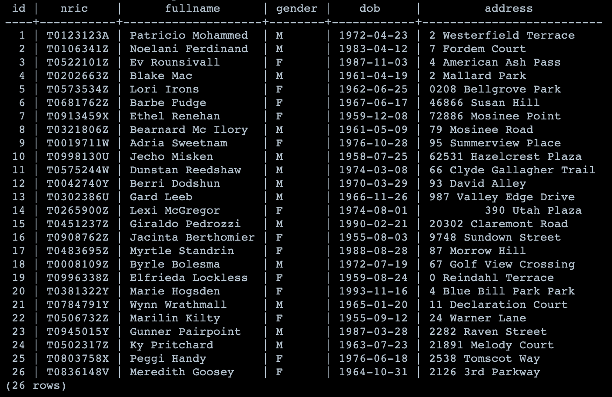
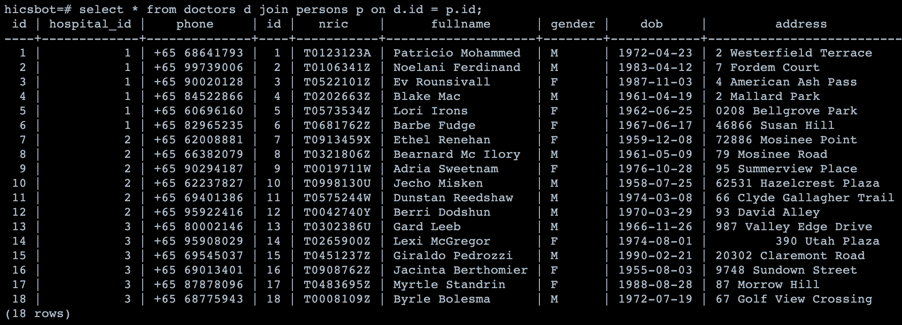
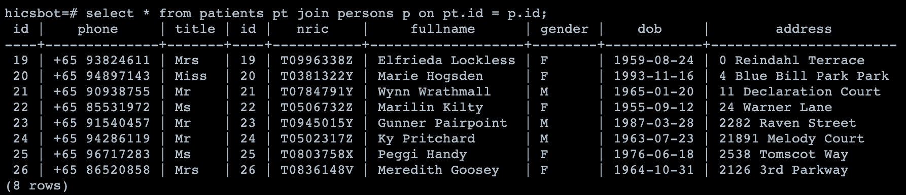
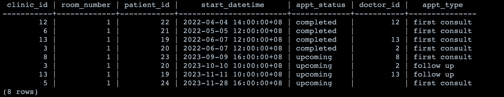
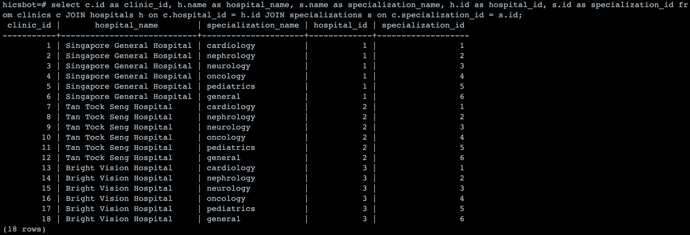
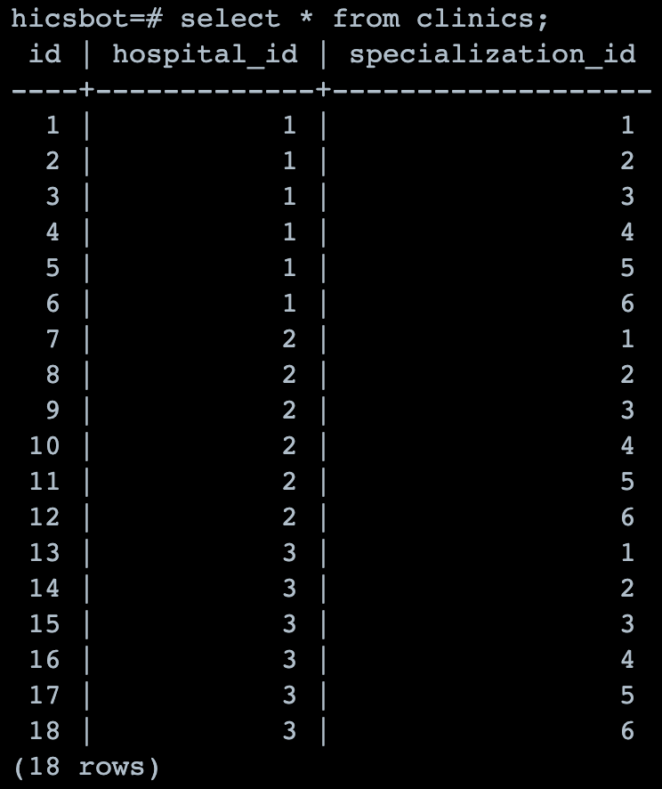
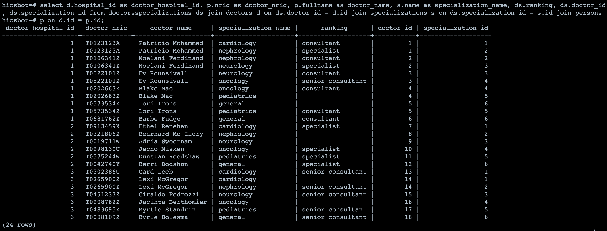
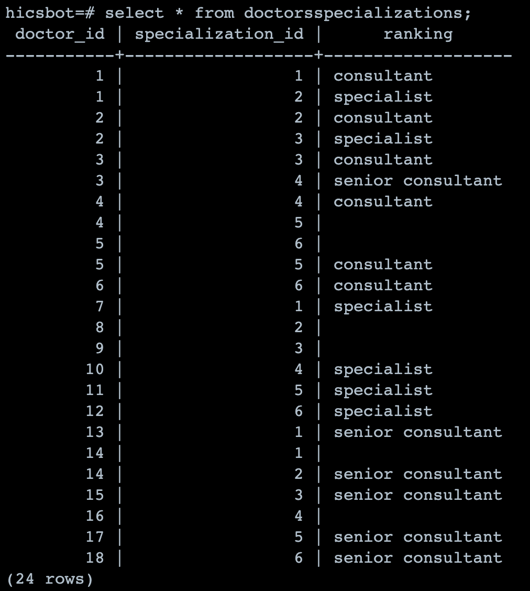

## HICS ChatBot
Simple chatbot that is able to handle appointment management for healthcare services. 
[Try it out!](https://hics-chatbot.vercel.app/)

<br>Integrated with:
- Azure's ConversationalLanguageUnderstanding Model
- PostgreSQL database (deployed on Render)

## Bot flow
1. "Is caller registered in the database?"
    1. Yes: Requests for NRIC to **fetch** the patient from the database (eg. )
    1. No: Creates a patient in our database (and continues execution with this new patientData) *– (not implemented yet, currently most of the fields are hard-coded in)*

1. "How can I help you?"
    1. "Book" 
        i. "Follow up appt or new appt?" 
    1. "Cancel"
    1. "Reschedule" *– (not implemented yet, just executes a cancel and then a book)*
    1. "Don't understand" – Direct to human 
1. "Thank you for your time" -> ends conversation


#### (2a) "Book"
1. (fetches most recent appt data if it exists)
1. "Follow up or new appt" (if recent appt exists), othewise: only "new appt"
1. "Specialized treatment or general?" -> sets: specialization (see Specializations for possible predictions)
1. "Private or subsidized?"
    1. "Subsidized" -> doctorId = null
    1. "Private" -> "Consultant, specialist or senior consultant" -> get first doctorId that matches (ie. specialization & ranking)
1. Find first available datetime (given: doctorId, specialization) 
1. Confirm? 
    1. Y -> create new appointment
    1. N -> ends dialog

#### (2a) "Cancel"
1. (fetches next upcoming appt data if it exists)
1. If doesn't exist:
    1. "No upcoming appts. Would you like to book an appointment instead?"
        1. Y -> navigate to `BookAppointment`
        1. N -> End
1. If exists:
    1. Confirm cancel this appointment?
        1. Y –> cancel
        1. N -> End

---

### Database Data

* (default) Patients (you will need the corresponding NRICs):
    1. Patients with 1 past appointment & 1 upcoming appointments:
        1. patientId = 19: Elfrieda Lockless, NRIC = T0996338Z
        1. patientId = 20: Marie Hogsden    , NRIC = T0381322Y

    1. Patients with 1 past appointment but no upcoming appointments:
        1. patientId = 21: Wynn Wrathmall , NRIC = T0784791Y
        1. patientId = 22: Marilin Kilty  , NRIC = T0506732Z

    1. Patients with no past appointments but with 1 upcoming appointment:
        1. patientId = 23: Gunner Pairpoint , NRIC = T0945015Y
        1. patientId = 24: Ky Pritchard     , NRIC = T0502317Z

    1. Patients with no past & no upcoming appointments: (ie. patient data is just in DB)
        1. patientId = 25: Peggi Handy     , NRIC = T0803758X
        1. patientId = 26: Meredith Goosey , NRIC = T0836148V


* Specializations: 
    | id |    name    |
    |----|------------|
    | 1  | cardiology |
    | 2  | nephrology |
    | 3  | neurology  |
    | 4  | oncology   |
    | 5  | pediatrics |
    | 6  | general    |

* Hospitals:

    | id |            name            |                         location                          | hospital_type |
    |----|----------------------------|-----------------------------------------------------------|---------------|
    |  1 | Singapore General Hospital | Singapore General Hospital, Outram Road, Singapore 169608 | acute         |
    |  2 | Tan Tock Seng Hospital     | 11 Jalan Tan Tock Seng, Singapore 308433                  | acute         |
    |  3 | Bright Vision Hospital     | 5 Lorong Napiri, Singapore 547530                         | community     |


### Database API endpoints

* [(for testing purposes!) Resets the mock database](https://hicschatbot-dbservice.onrender.com/admin/resetDatabase)
    - POST request, no body, resets database

* [get all patients](https://hicschatbot-dbservice.onrender.com/patients/getAllPatients)
    - gets a list of all patients in the database

* [get all doctors](https://hicschatbot-dbservice.onrender.com/doctors/getAllDoctors)
    - gets a list of all doctors in the database

* [get all appointments](https://hicschatbot-dbservice.onrender.com/appointments/getAllAppointments)
    - gets a list of all appointments in the database

#### Snapshots of the Mockdata for the database:
(initial state, immediately after /resetDatabase API endpoint is called)

**Persons**


**Doctors**


**Patients**


**Appointments**


**Clinic**
1. more descriptive representation of data:


1. table data


**DoctorsSpecializations**
1. more descriptive representation of data:


1. table data



---

# EchoBot

Bot Framework v4 echo bot sample.

This bot has been created using [Bot Framework](https://dev.botframework.com), it shows how to create a simple bot that accepts input from the user and echoes it back.

## Prerequisites

- [.NET SDK](https://dotnet.microsoft.com/download) version 6.0

  ```bash
  # determine dotnet version
  dotnet --version
  ```

## To try this sample

- Clone the repository

    ```bash
    git clone https://github.com/Microsoft/botbuilder-samples.git
    ```

- Run the bot from a terminal or from Visual Studio:

  A) From a terminal, navigate to `samples/csharp_dotnetcore/02.echo-bot`

  ```bash
  # run the bot
  dotnet run
  ```

  B) Or from Visual Studio

  - Launch Visual Studio
  - File -> Open -> Project/Solution
  - Navigate to `samples/csharp_dotnetcore/02.echo-bot` folder
  - Select `EchoBot.csproj` file
  - Press `F5` to run the project

## Testing the bot using Bot Framework Emulator

[Bot Framework Emulator](https://github.com/microsoft/botframework-emulator) is a desktop application that allows bot developers to test and debug their bots on localhost or running remotely through a tunnel.

- Install the latest Bot Framework Emulator from [here](https://github.com/Microsoft/BotFramework-Emulator/releases)

### Connect to the bot using Bot Framework Emulator

- Launch Bot Framework Emulator
- File -> Open Bot
- Enter a Bot URL of `http://localhost:3978/api/messages`

## Interacting with the bot

Enter text in the emulator.  The text will be echoed back by the bot.

## Deploy the bot to Azure

To learn more about deploying a bot to Azure, see [Deploy your bot to Azure](https://aka.ms/azuredeployment) for a complete list of deployment instructions.

## Further reading

- [Bot Framework Documentation](https://docs.botframework.com)
- [Bot Basics](https://docs.microsoft.com/azure/bot-service/bot-builder-basics?view=azure-bot-service-4.0)
- [Activity processing](https://docs.microsoft.com/en-us/azure/bot-service/bot-builder-concept-activity-processing?view=azure-bot-service-4.0)
- [Azure Bot Service Introduction](https://docs.microsoft.com/azure/bot-service/bot-service-overview-introduction?view=azure-bot-service-4.0)
- [Azure Bot Service Documentation](https://docs.microsoft.com/azure/bot-service/?view=azure-bot-service-4.0)
- [.NET Core CLI tools](https://docs.microsoft.com/en-us/dotnet/core/tools/?tabs=netcore2x)
- [Azure CLI](https://docs.microsoft.com/cli/azure/?view=azure-cli-latest)
- [Azure Portal](https://portal.azure.com)
- [Channels and Bot Connector Service](https://docs.microsoft.com/en-us/azure/bot-service/bot-concepts?view=azure-bot-service-4.0)
