## HICS ChatBot
Simple chatbot that is able to handle appointment management for healthcare services. 
[Try it out!](https://hics-chatbot.vercel.app/)

<br>Integrated with:
- Azure's ConversationalLanguageUnderstanding Model
- PostgreSQL database (deployed on Render)

## Bot flow
1. "Is caller registered in the database?"
    1. Yes: Requests for NRIC to **fetch** the patient from the database (eg. )
    1. No: Creates a patient in our database (and continues execution with this new patientData) *– (not implemented yet, currently most of the fields are hard-coded in)*

1. "How can I help you?"
    1. "Book" 
        i. "Follow up appt or new appt?" 
    1. "Cancel"
    1. "Reschedule" *– (not implemented yet, just executes a cancel and then a book)*
    1. "Don't understand" – Direct to human 
1. "Thank you for your time" -> ends conversation


#### (2a) "Book"
1. (fetches most recent appt data if it exists)
1. "Follow up or new appt" (if recent appt exists), othewise: only "new appt"
1. "Specialized treatment or general?" -> sets: specialization (see Specializations for possible predictions)
1. "Private or subsidized?"
    1. "Subsidized" -> doctorId = null
    1. "Private" -> "Consultant, specialist or senior consultant" -> get first doctorId that matches (ie. specialization & ranking)
1. Find first available datetime (given: doctorId, specialization) 
1. Confirm? 
    1. Y -> create new appointment
    1. N -> ends dialog

#### (2a) "Cancel"
1. (fetches next upcoming appt data if it exists)
1. If doesn't exist:
    1. "No upcoming appts. Would you like to book an appointment instead?"
        1. Y -> navigate to `BookAppointment`
        1. N -> End
1. If exists:
    1. Confirm cancel this appointment?
        1. Y –> cancel
        1. N -> End

---

### Database Data

* (default) Patients (you will need the corresponding NRICs):
    1. Patients with 1 past appointment & 1 upcoming appointments:
        1. patientId = 19: Elfrieda Lockless, NRIC = T0996338Z
        1. patientId = 20: Marie Hogsden    , NRIC = T0381322Y

    1. Patients with 1 past appointment but no upcoming appointments:
        1. patientId = 21: Wynn Wrathmall , NRIC = T0784791Y
        1. patientId = 22: Marilin Kilty  , NRIC = T0506732Z

    1. Patients with no past appointments but with 1 upcoming appointment:
        1. patientId = 23: Gunner Pairpoint , NRIC = T0945015Y
        1. patientId = 24: Ky Pritchard     , NRIC = T0502317Z

    1. Patients with no past & no upcoming appointments: (ie. patient data is just in DB)
        1. patientId = 25: Peggi Handy     , NRIC = T0803758X
        1. patientId = 26: Meredith Goosey , NRIC = T0836148V


* Specializations: 
    | id |    name    |
    |----|------------|
    | 1  | cardiology |
    | 2  | nephrology |
    | 3  | neurology  |
    | 4  | oncology   |
    | 5  | pediatrics |
    | 6  | general    |

* Hospitals:

    | id |            name            |                         location                          | hospital_type |
    |----|----------------------------|-----------------------------------------------------------|---------------|
    |  1 | Singapore General Hospital | Singapore General Hospital, Outram Road, Singapore 169608 | acute         |
    |  2 | Tan Tock Seng Hospital     | 11 Jalan Tan Tock Seng, Singapore 308433                  | acute         |
    |  3 | Bright Vision Hospital     | 5 Lorong Napiri, Singapore 547530                         | community     |


### Database API endpoints

* [(for testing purposes!) Resets the mock database](https://hicschatbot-dbservice.onrender.com/admin/resetDatabase)
    - POST request, no body, resets database

* [get all patients](https://hicschatbot-dbservice.onrender.com/patients/getAllPatients)
    - gets a list of all patients in the database

* [get all doctors](https://hicschatbot-dbservice.onrender.com/doctors/getAllDoctors)
    - gets a list of all doctors in the database

* [get all appointments](https://hicschatbot-dbservice.onrender.com/appointments/getAllAppointments)
    - gets a list of all appointments in the database

#### Snapshots of the Mockdata for the database:
(initial state, immediately after /resetDatabase API endpoint is called)

**Persons**
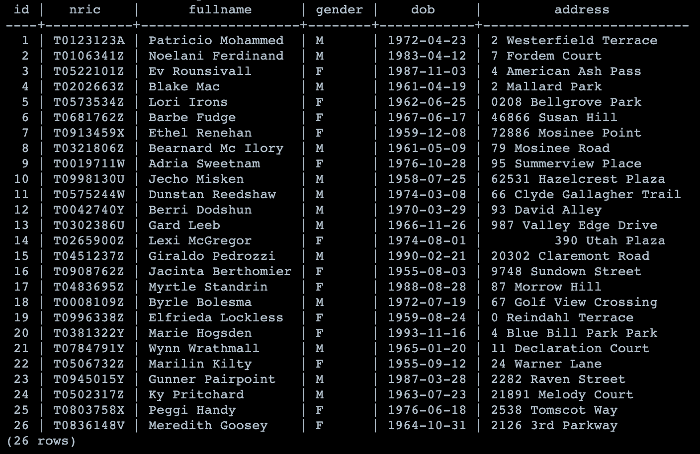

**Doctors**
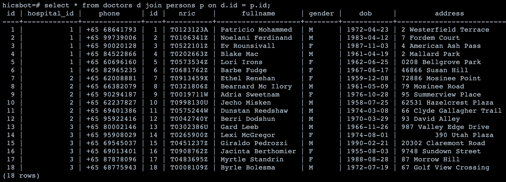

**Patients**
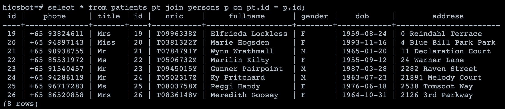

**Appointments**
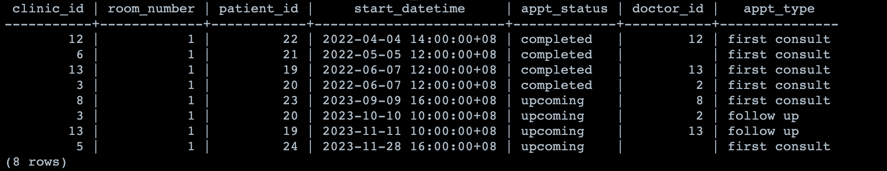

**Clinic**
1. more descriptive representation of data:
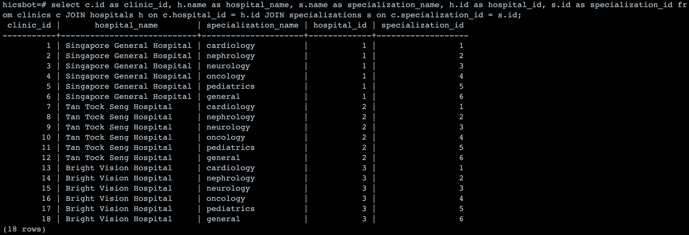

1. table data
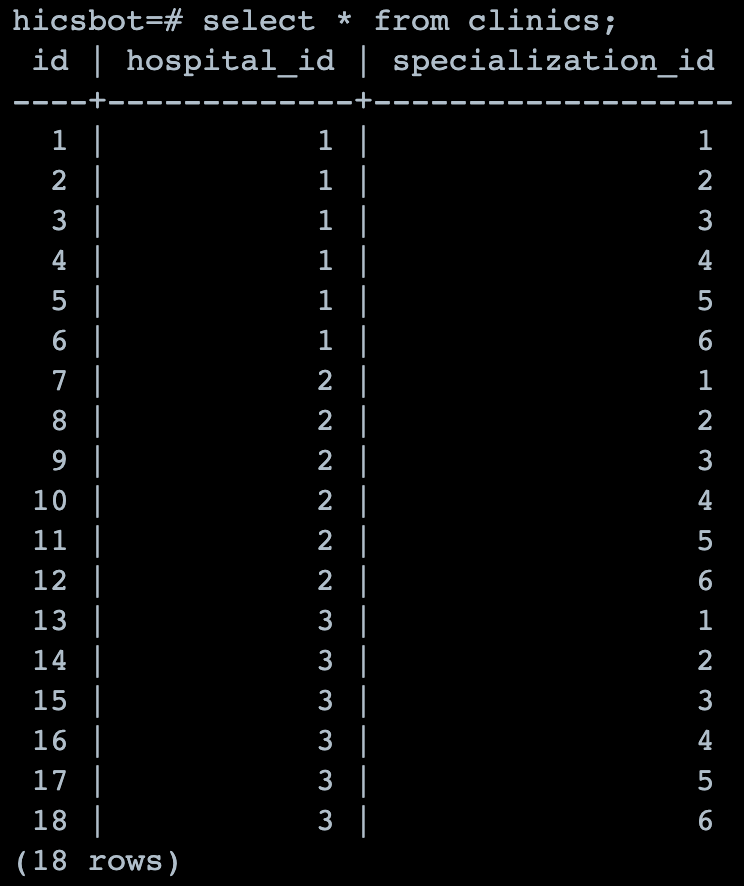

**DoctorsSpecializations**
1. more descriptive representation of data:
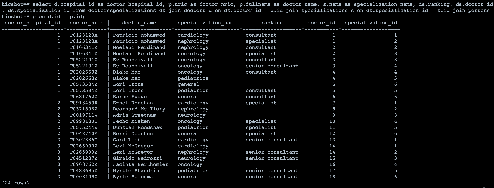

1. table data
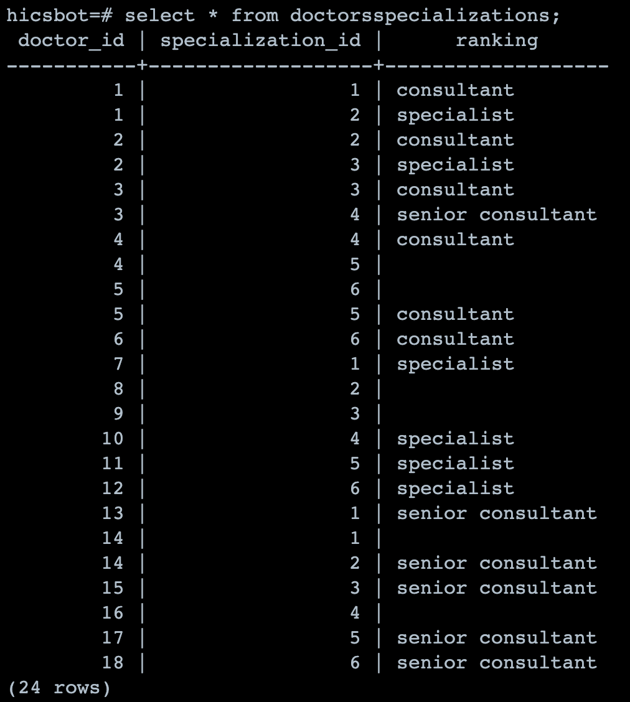

---
## How to:

#### Prerequisites:
- [.NET SDK](https://dotnet.microsoft.com/download) version 6.0
  ```bash
  # determine dotnet version
  dotnet --version
  ```

#### Local Development for Bot
Azure Configurations (eg. credentials, endpoints) are defined in Azure Portal.

To be able to set the appropriate configurations for local development, (for `CluModelService.cs` and `DatabaseServices/BaseService.cs`)
you can do either: 
1. You can set the environment variables when bot starts up. (not implemented yet)
1. Replace `System.Environment.GetEnvironmentVariable` with the apprpriate values.
    * Warning: Do not push these fields to Github repo. (Some variables, eg. Azure Key credentials for CLU Model Service are secrets!)

* You also have to change the `MicrosoftAppId` and `MicrosoftAppPassword` (in `appsettings.json`) to empty strings (ie. "").

#### Testing the Bot (locally, Bot Framework Emulator)

[Bot Framework Emulator](https://github.com/microsoft/botframework-emulator) is a desktop application that allows bot developers to test and debug their bots on localhost or running remotely through a tunnel.

- Install the latest Bot Framework Emulator from [here](https://github.com/Microsoft/BotFramework-Emulator/releases)

After running `dotnet run` in root of local cloned repo,
1. Launch Bot Framework Emulator
1. Select 'Open Bot'
1. Bot Url: `http://localhost:3978/api/messages`
    * default port used is '3978', but if you changed the port number when running the bot, change this url accordingly.
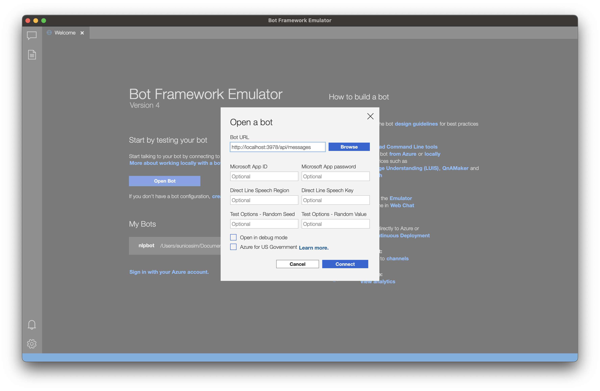

#### Work with Conversational Language Service

**Requirements**
* Azure Account
* Must be given access to the language service
    * To give access, navigate to 'Access Control (IAM)' from [Azure Portal](https://portal.azure.com) and select 'Add' > 'Add Role assignment'
        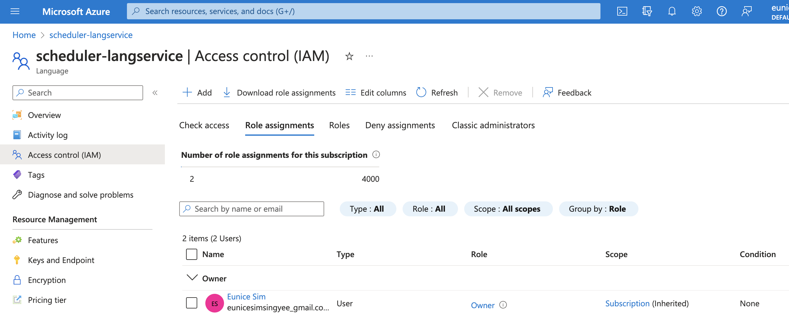 

To view the project:
* Azure Portal > 'Resources'
* [Language Portal](https://language.cognitive.azure.com/)
    * Set the Conversational Language Understanding Service to the service you have access to. 
    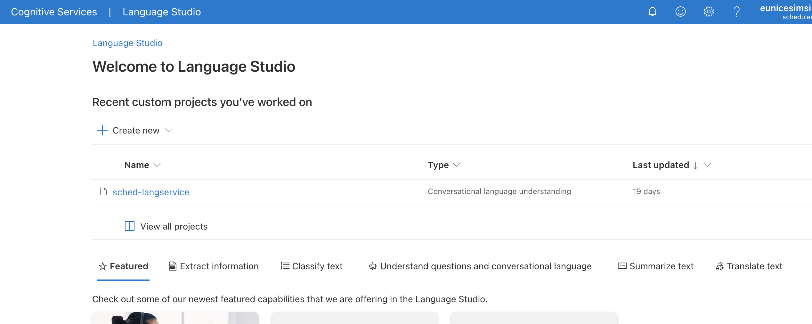


**1. Adding Intent / Entity**
(the schema can be modified in data labelling as well.)
1. Go to: 'Schema Definition'
    * Note that the names used for the intent / entity in 'Schema Definition' is also used when calling the Service's API endpoint
    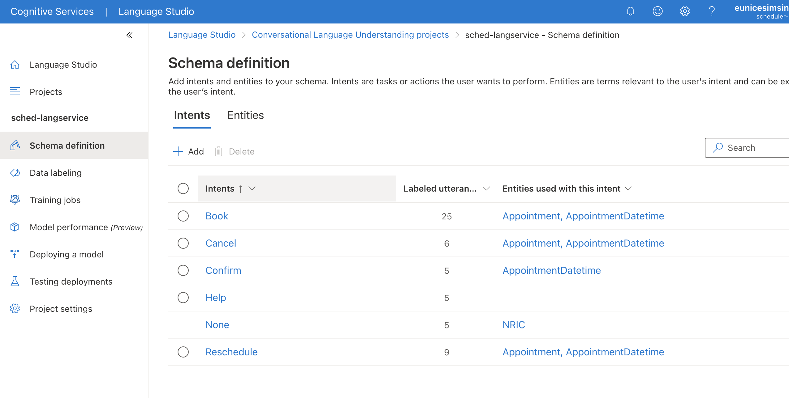
1. 'Add' to add new intents / entities
1. (For entities) Select entity (radio) and 'Edit entity components' to edit the entity

**1. Adding Utterances / data**
1. Select the intent and type in the utterance
    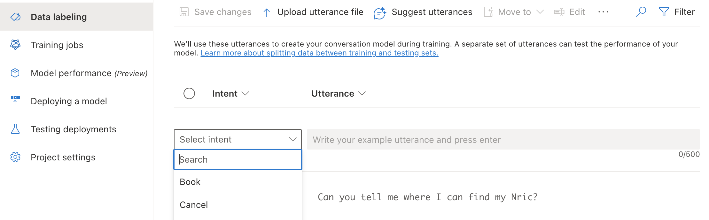
1. To indicate a (learned) entity:
    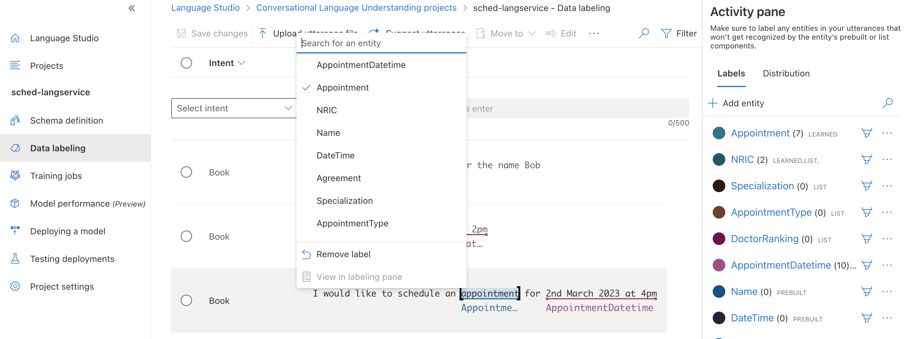
    * Highlight the utterance with text and select the corresponding
    * Note: Azure provides many pre-built components, list and regex. To configure these, click on the entity on the Activity Pane.
        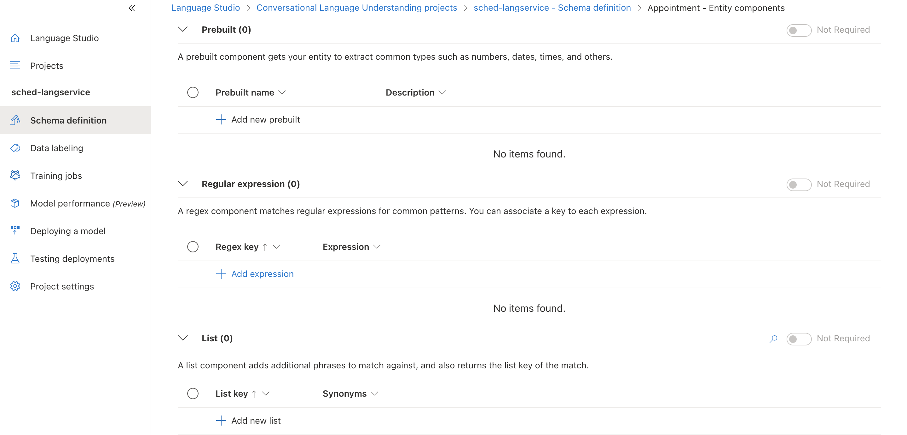
1. Ensure you 'save changes' after making changes to the data

**1.Training the Model**
1. 'Start a training job'
1. Training job configuration:
    * choose: train new model or overwrite existing model
    * Data splitting: you can use the default 80-20 split
1. 'Train' > wait for the training to complete

**1.Deploying the Model**
1. 'Add deployment'
1. Deployment configuration:
    * Create new or Overwrite existing deployment
    * Model: select the trained model


**1.Testing the Model**
1. Testing in Language Portal
    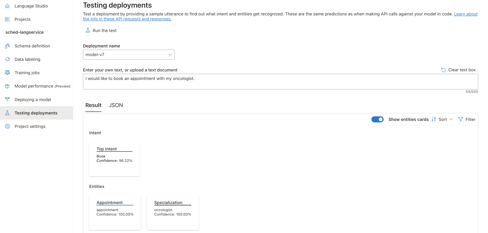
    * Select:
        * deployment name: the deployment of model you want to test
        * text / utterance: the test utterance / query
    * 'Run the test'

1. Call the API / From the Bot:
    * Change `deploymentName` in `CluModelService.cs` if a new deployment was created. 